# Universidad UNIVERSIDAD TÉCNICA DE AMBATO 
## Facultad de FACULTAD DE INGENIERÍA EN SISTEMAS, ELECTRONICA E IDUSTRIAL  
### Carrera de SOFTWARE  

**Asignatura:** Manejo y Configuración de Software  
**Nombre del Estudiante:** DAVID ALEXANDER PÉREZ ÁLVAREZ 
**Fecha:** 08/04/2026

---

# Evaluación Práctica de Git y GitHub

## Instrucciones Generales

- Cada pregunta debe ser respondida directamente en este archivo **(README.md)** debajo del enunciado correspondiente. 
- Es importante que se coloque capturas de pantalla como evidencia de la parte práctica. Se recomienda crear una carpeta `images/` para almacenar las capturas de pantalla.
- Cada respuesta debe ir acompañada de uno o más **commits**, según se indique en cada pregunta.
- Cuando se indique, deberán realizarse acciones prácticas dentro del repositorio (como creación de archivos, ramas, resolución de conflictos, etc.).
- Cada pregunta debe estar **etiquetada con un tag**, únicamente en el commit final correspondiente, con el formato: `"Pregunta 1"`, `"Pregunta 2"`, etc.

---

## Pregunta 1 (1 punto)

**Explicar la diferencia entre los siguientes conceptos/comandos en Git y GitHub:**

- `git clone`  
- `fork`  
- `git pull`

### Parte práctica:

- Realizar un **fork** de este repositorio en la cuenta personal de GitHub del estudiante.
- Luego, realizar un **clone** del fork en el equipo local.
- En este README, describir el proceso seguido:
  - ¿Cómo se realizó el fork?
  - ¿Cómo se realizó el clone del fork?
  - ¿Cómo se verificó que se estaba trabajando sobre el fork y no sobre el repositorio original?
- Realizar en la rama `main` todo lo que corresponde a esta pregunta.

**📝 Respuesta:**

<!-- Escribe aquí tu respuesta a la Pregunta 1 -->
- Git clone: El comando git clone se utiliza para clonar un repositorio existente en una ubicación local en el sistema de archivos.
- Git fork: El comando git fork se utiliza para crear una copia de un repositorio existente en una cuenta de GitHub personal.
- Git pull: El comando git pull se utiliza para obtener actualizaciones de un repositorio remoto en una rama local.

- ¿Cómo se realizó el fork?
1.- Se accede al repositorio original.

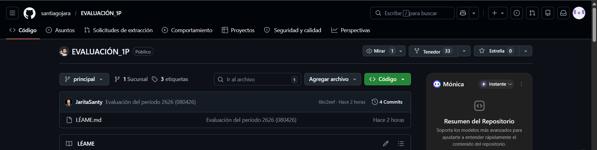

2.- Se crea un fork del repositorio original en la cuenta personal de GitHub.

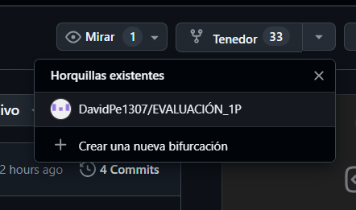

3.- Se ingresa una descripción
4.- Se da clic en "Fork" y nos redirecciona a la copia del repositorio.

- ¿Cómo se realizó el clone?
1.- Se accede al repositorio folk en GitHub.
2.- Se copia el URL del repositorio.
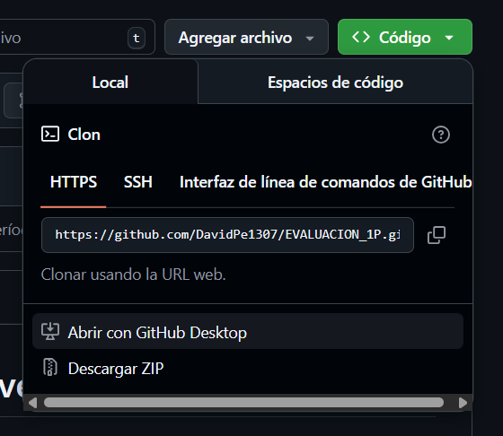
3.-Entramos a Git Bash y se ingresa el comando git clone y pegamos el URL del repositorio.
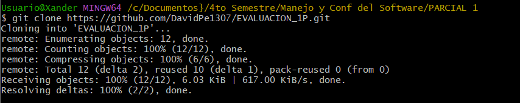

-¿Cómo se verificó que se estaba trabajando sobre el fork y no sobre el repositorio original?
Se verifica que estamos trabajando en la copia del repositorio en la cuenta personal de GitHub. Ya que este cuenta con un mensaje de verificación de fork en la cuenta personal de GitHub.
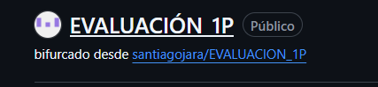

---

## Pregunta 2 (1 punto)

**Configurar un archivo `.gitignore` para que ignore:**

- Todos los archivos con extensión `.log`.
- Una carpeta llamada `temp/`.
- Todos los archivos `.md` y `.txt`de la carpeta `doc/`. (Probar agregando un archivo `prueba.md` y un archivo `prueba.txt` dentro de la carpeta y fuera de la carpeta.)

### Requisitos:

1. Realizar un **primer commit** que incluya únicamente el archivo `.gitignore` con las reglas de exclusión definidas.
2. Realizar un **segundo commit** que incluya las creación de los archivos de prueba.
2. Realizar un **tercer commit** donde se explique en este README la función del archivo `.gitignore` y se muestre evidencia de que los archivos y carpetas indicadas no están siendo rastreadas por Git.

**Importante:**  
- Solo el **tercer commit** debe llevar el **tag `"Pregunta 2"`**.

1.- Primer comit
- Creamos el archivo .gitignore
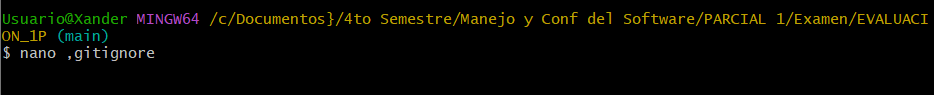
- Asignamos las reglas de exclusión.
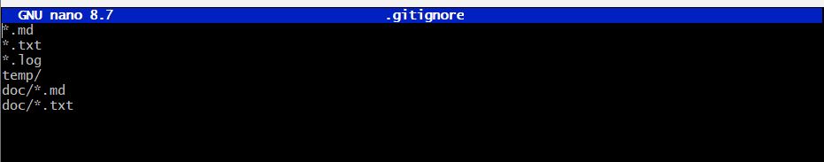
-Realizamos el primer commit
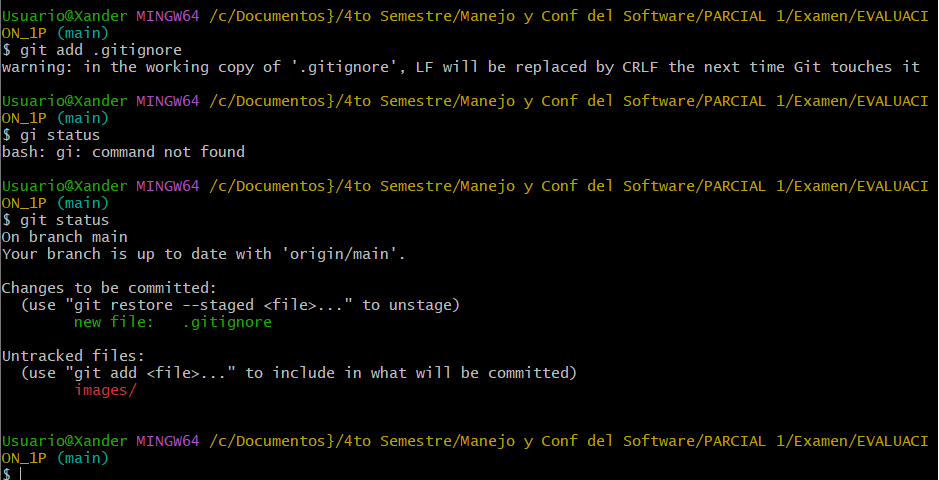
-Validamos que se haya hecho el commit.
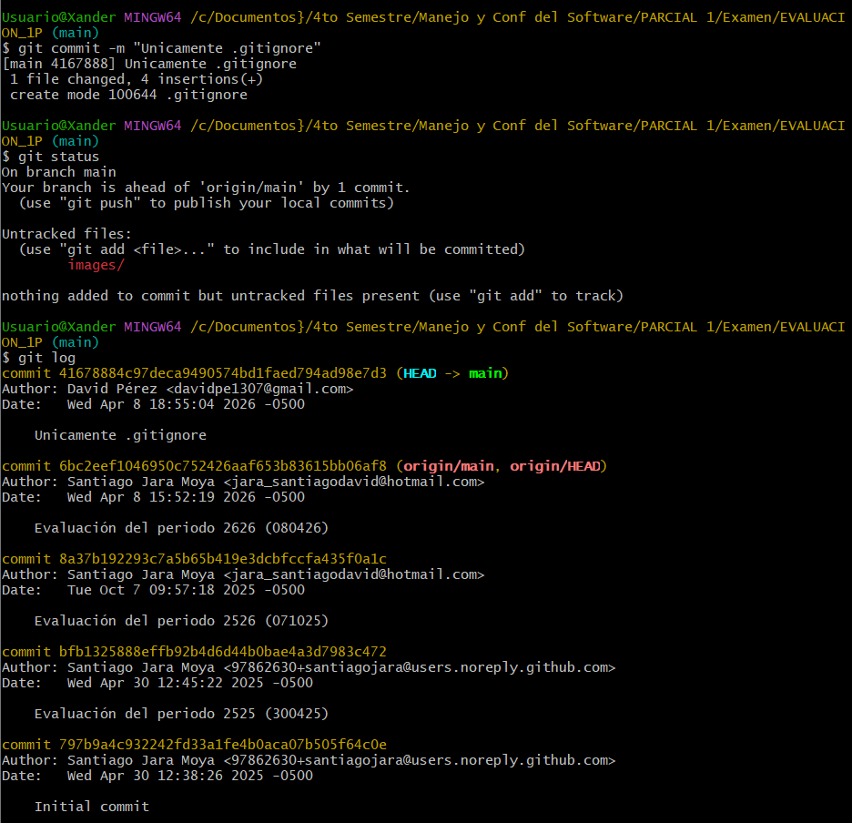

2.- Segundo comit
-Creamos los archivos de prueba.
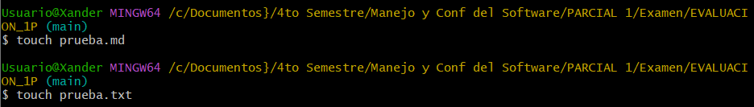
-Realizamos el segundo commit
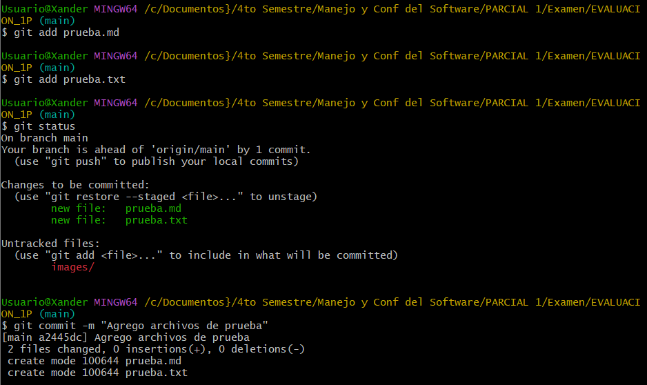
-Validamos que se haya hecho el commit.
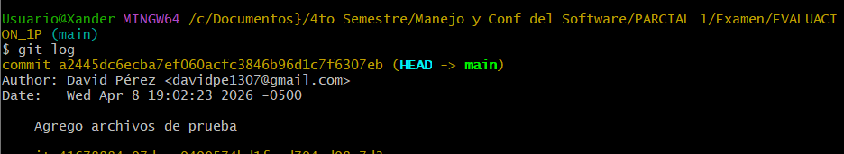
-Creamos archivos dentro de la carpeta doc con un tercer commit.
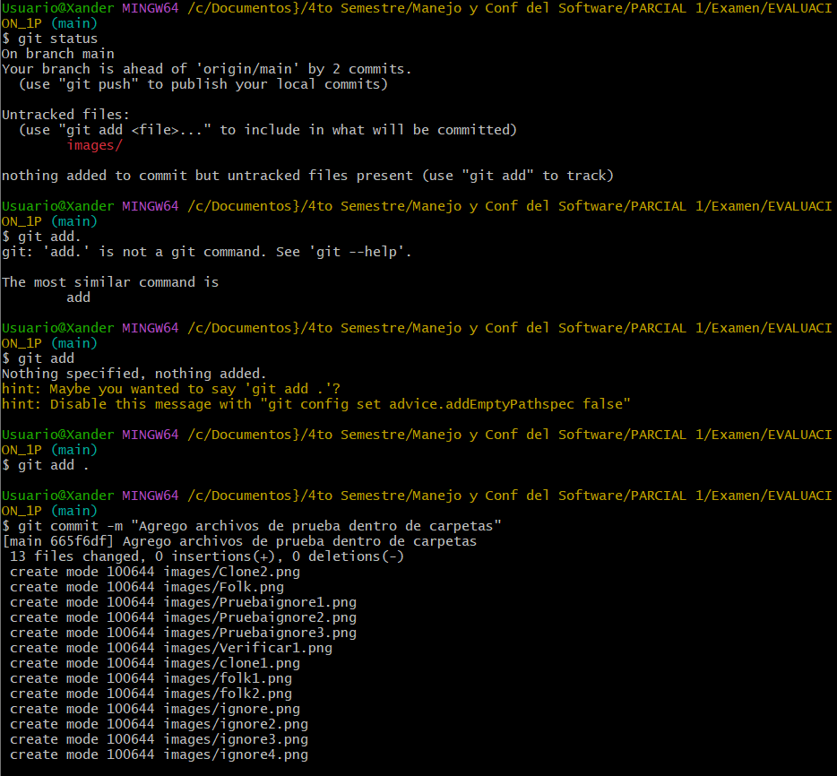

3.- Tercer comit
- Dentro de git bash se ingresa git status --ignored, nos dara como resultado la carpeta y archivos que se estan ignorando, en este caso solo la carpeta doc.
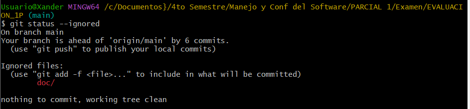
- Ademas agregamos el tag 'Pregunta 2'

**📝 Respuesta:**

---

## Pregunta 3 (2 puntos)

**Utilizar Git Flow para desarrollar una nueva funcionalidad llamada `ingresar-encabezado`.**

### Requisitos:

- Inicializar el repositorio con Git Flow, utilizando las ramas por defecto: `main` y `develop`.
- Crear una rama de tipo `feature` con el nombre `ingresar-encabezado`.
- En dicha rama, **completar con los datos personales del estudiante** el encabezado que ya se encuentra al inicio de este archivo `README.md`.
- Realizar al menos un commit durante el desarrollo.
- Finalizar el hotfix siguiendo el flujo de trabajo establecido por Git Flow.

### En la sección de respuesta, se debe incluir:

- Los **comandos exactos** utilizados desde la inicialización de Git Flow hasta el cierre de la rama.
- Una descripción del **proceso seguido**, indicando el propósito de cada paso.
- Una reflexión sobre las **ventajas de aplicar Git Flow**, especialmente en contextos colaborativos o proyectos de larga duración.

**Importante:**

- Deben realizarse varios commits durante esta pregunta.
- **Solo el commit final** debe llevar el **tag `"Pregunta 3"`**.
- El flujo debe respetar la estructura de Git Flow con las ramas `develop` y `main`.

1.- Inicializamos el repositorio con git flow
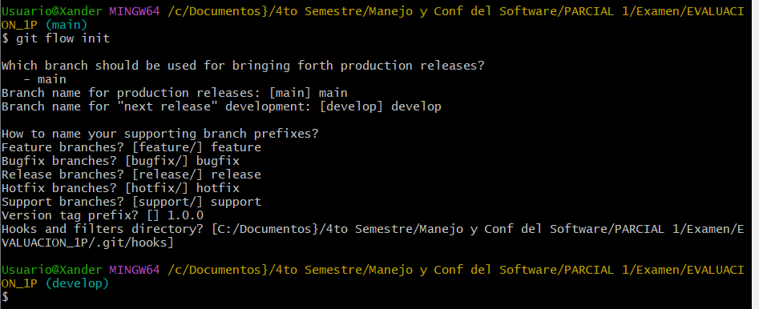

2.- Creamos la rama de tipo feature con el nombre ingresar-encabezado
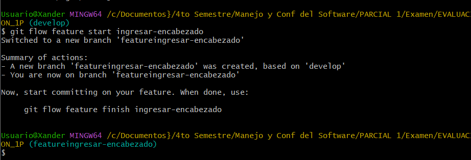

3.- Modificamos el encabezado del README
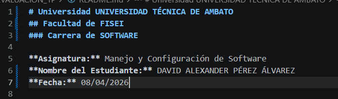

4.- Realizamos un commit
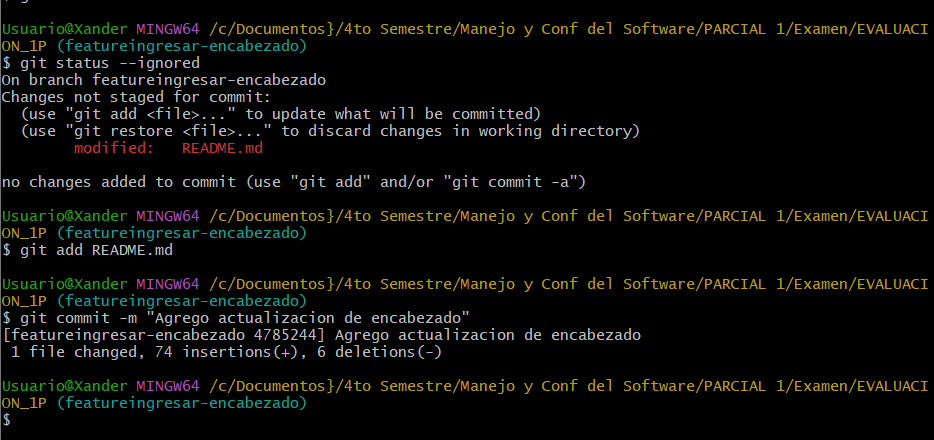

5.- Finalizamos la rama

**📝 Respuesta:**

Comandos utilizados
* git flow init
* git flow feature start ingresar-encabezado
* git flow feature finish ingresar-encabezado

Proceso seguido
* Inicializamos el repositorio con git flow
* Creamos la rama de tipo feature con el nombre ingresar-encabezado
* Modificamos el encabezado del README
* Realizamos un commit
* Finalizamos la rama

Ventajas de aplicar Git Flow
* Facilita la gestión de ramas
* Separación entre desarrollo y producción
* Facilita la colaboración en proyectos de larga duración

<!-- Escribe aquí tu respuesta completa a la Pregunta 3 -->

---

## Pregunta 4 (2 puntos)

**Trabajo con Issues y Pull Requests**

### Parte teórica:

- ¿Qué es un Pull Request y cuál es su función dentro de un flujo de trabajo colaborativo con Git y GitHub?
- ¿Por qué es importante revisar un Pull Request antes de fusionarlo con la rama principal?
- ¿Qué tipo de observaciones o validaciones se suelen realizar durante la revisión de un Pull Request?

### Parte práctica:

- Trabajar en la rama `develop`, ya existente desde la configuración de Git Flow.
- Realizar los cambios necesarios en este archivo `README.md` para responder las preguntas.
- Realizar un **commit** con los cambios de la primera pregunta y subirlo a la rama `develop` del repositorio remoto.
- Crear un **pull request** desde `develop` hacia `main` en GitHub, con el nombre `"Pregunta 4 - Apellido Nombre"`.
- Crear comentarios solicitando: 1. que se agregue la respuesta de la segunda pregunta y luego agregando la respuesta con el respectivo commit; y 2. el mismo procedimiento para la tercera pregunta.
- **Aprobar** el pull request para que se haga el merge respectivo hacia `main`.

### En la sección de respuesta, se debe incluir:

- Un resumen del procedimiento realizado con las respectivas preguntas y capturas.
- El número y enlace al pull request.

**📝 Respuesta:**

1. ¿Qué es un Pull Request y cuál es su función dentro de un flujo colaborativo?
Un Pull Request (PR) es una solicitud que realiza un desarrollador para proponer cambios en un repositorio, generalmente desde una rama (por ejemplo, feature) hacia otra (como main o develop). Su función principal es permitir la revisión, discusión y validación del código antes de integrarlo al proyecto principal, facilitando el trabajo colaborativo y el control de versiones.

---

## Pregunta 5 (2 puntos)

**Resolver conflictos entre ramas y realizar un Pull Request**

### Requisitos:

- Crear dos ramas llamadas `ramaA` y `ramaB`, ambas a partir de la rama `develop`.
- En `ramaA`, crear un archivo llamado `archivoA.txt` con el contenido:  
  `Contenido A`
- En `ramaB`, crear un archivo con el mismo nombre (`archivoA.txt`), pero con el contenido:  
  `Contenido B`
- Intentar fusionar `ramaB` sobre `ramaA`, lo cual debe generar un conflicto.
- Resolver el conflicto combinando ambos contenidos.
- Realizar el merge de `ramaA` hacia `develop`.
- Crear un **pull request** desde `develop` hacia `main`.
- Una vez completado lo anterior, eliminar las ramas `ramaA` y `ramaB`.

### En la sección de respuesta, se debe incluir:

- El procedimiento completo:
  - Cómo se crearon las ramas.
  - Cómo se generó y resolvió el conflicto.
  - Cómo se realizó el merge hacia `develop`.
  - Cómo se eliminaron las ramas al finalizar.
- El enlace al pull request.
- Una breve explicación de qué es un conflicto en Git y por qué ocurrió en este caso.

**📝 Respuesta:**

<!-- Escribe aquí tu respuesta completa a la Pregunta 5 -->

---

## Pregunta 6 (2 puntos)

**Realizar limpieza, explicar versionamiento semántico y enviar cambios al repositorio original**

### Requisitos:

- Trabajar en la rama `develop` del fork del repositorio.
- Eliminar los archivos `archivoA.txt` y `archivoB.txt` creados en preguntas anteriores.
- Realizar un merge desde `develop` hacia `main` en el repositorio local.
- Enviar los cambios de la rama `main` local a la rama `develop` del repositorio remoto (fork). Recuerde incluir todos los tags creados (6 tags).
- Finalmente, crear un **pull request** desde la rama `develop` del fork hacia la rama `main` del repositorio original (del cual se realizó el fork en la Pregunta 1). El titulo del pull request debe ser `"NOMBRE APELLIDOS"`, en la descripción colocar el link de su repositorio de GitHub.

### En la sección de respuesta, se debe incluir:

- Una explicación del proceso realizado paso a paso.
- Una explicación del **versionamiento semántico**, indicando:
  - En qué consiste.
  - Sus tres componentes (MAJOR, MINOR, PATCH).
- Si hace falta agregar alguna evidencia adicional, agregue un tag adicional que sea `Version Final`.

**📝 Respuesta:**

<!-- Escribe aquí tu respuesta completa a la Pregunta 6 -->
